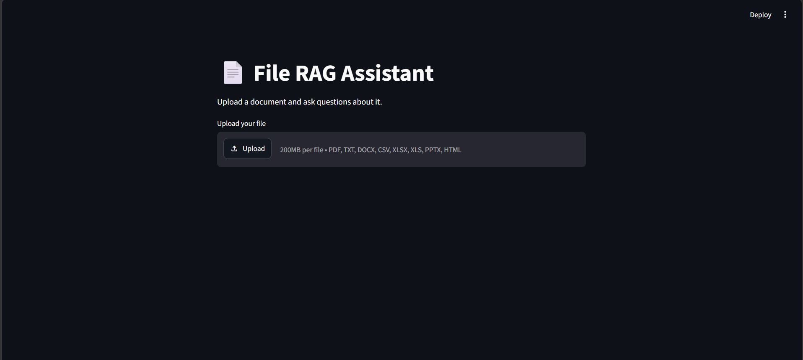
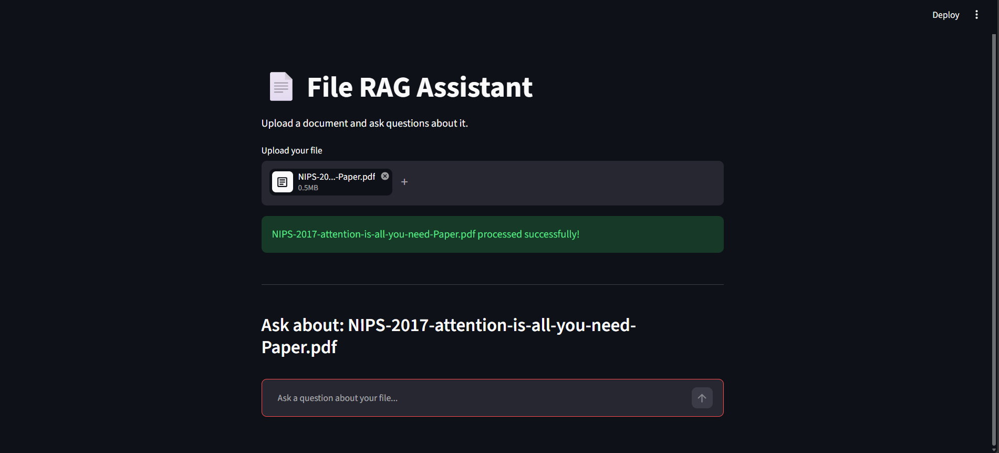
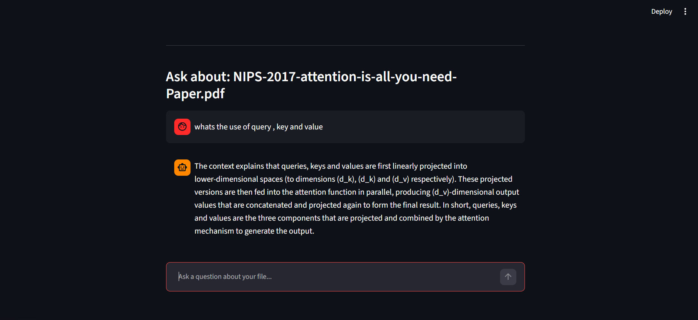

# 📄 AI Documents Chatbot (LangChain + RAG)

A **Retrieval-Augmented Generation (RAG)** chatbot that lets you upload a document and ask questions about it. It extracts, chunks, embeds, and retrieves relevant content from your file, then uses an LLM (via Groq) to generate answers grounded strictly in that document — no hallucinated outside knowledge.

Built with **LangChain**, **ChromaDB**, **HuggingFace embeddings**, **Groq LLM**, and **Streamlit**.

---

## 🎯 Problem Domain

**Use case: answering questions from your own documents.**

Students, researchers and professionals spend a lot of time hunting through long documents (research papers, reports, notes, spreadsheets) for one specific fact. Keyword search misses paraphrased wording, and asking a general-purpose LLM directly is risky because it doesn't have the document and may answer from memory, or make something up.

This chatbot uses Retrieval-Augmented Generation (RAG) to fix both problems. It retrieves the relevant passages from the uploaded file and tells the LLM to answer only from them, or to say it couldn't find the answer.

| | |
|---|---|
| **Who it helps** | Anyone who needs quick, checkable answers from a private or domain-specific document without reading it end to end |
| **Demo document** | *Attention Is All You Need* (the Transformer paper), a dense technical paper with exact facts (model sizes, scores) that are easy to verify |
| **Scope** | One document at a time: PDF, TXT, DOCX, CSV, XLSX/XLS, PPTX, HTML |

---

## ✨ Features

- 📁 **Multi-format document support** — PDF, TXT, DOCX, CSV, XLSX/XLS, PPTX, HTML
- ✂️ **Smart chunking** using `RecursiveCharacterTextSplitter`
- 🧠 **Local embeddings** via `sentence-transformers/all-MiniLM-L6-v2` (no embedding API cost)
- 🗂️ **Vector search** powered by ChromaDB with MMR (Maximal Marginal Relevance) retrieval
- ⚡ **Fast LLM inference** using Groq (`openai/gpt-oss-20b`)
- 🔒 **Grounded answers only** — the assistant explicitly refuses to answer from outside the uploaded document
- 🖥️ **Simple chat UI** built with Streamlit
- 📓 **End-to-end Jupyter notebook** with saved outputs, observations and a conclusion

---

## 🏗️ How It Works

1. **Upload** a document through the Streamlit UI.
2. **Load** — the file is routed to the correct loader based on its extension (`loaders/file_loader.py`).
3. **Split** — the extracted text is broken into overlapping chunks (`rag/splitter.py`).
4. **Embed & Store** — chunks are embedded and stored in a persistent Chroma vector store (`rag/vectorstore.py`, `rag/embeddings.py`).
5. **Retrieve** — relevant chunks are fetched using MMR search for diverse, relevant context.
6. **Generate** — the retrieved context and your question are passed into a strict, context-only prompt (`rag/prompt.py`) and sent to the Groq LLM (`rag/chain.py`).
7. **Answer** — the response is streamed back to you in the chat interface.

> A visual breakdown of both phases (document ingestion into the vector DB, and question answering) is available in [`workflow_docs/RAG_Workflow.pptx`](workflow_docs/RAG_Workflow.pptx).

---

## 📸 Screenshots

### Landing Page
Upload any supported document to get started.



### File Processed
Once uploaded, the file is loaded, chunked, embedded, and ready for questions.



### Question & Answer
Ask natural-language questions and get answers grounded in the document's content.



---

## 📂 Project Structure

```
Ai-Documents-Chatbot-Langchain/
├── app.py                     # Streamlit entry point (UI + orchestration)
├── AI_Documents_Chatbot_LangChain.ipynb   # End-to-end notebook (code + outputs + observations)
├── loaders/
│   ├── file_loader.py         # Routes files to the correct loader by extension
│   ├── excel_loader.py        # Custom loader for .xlsx/.xls files
│   └── __init__.py
├── rag/
│   ├── splitter.py            # Document chunking logic
│   ├── embeddings.py          # HuggingFace embedding model config
│   ├── vectorstore.py         # Chroma vector store + retriever setup
│   ├── prompt.py              # Context-only QA prompt template
│   ├── chain.py                # RAG chain (retriever -> prompt -> LLM -> parser)
│   └── __init__.py
├── testfiles/
│   ├── test_loader.py         # Tests for document loaders
│   ├── test_rag.py            # Tests for the RAG pipeline
│   └── test_llm.py            # Tests for LLM connectivity
├── data/uploads/               # Sample files for testing
├── Assets/                     # Screenshots used in this README
├── workflow_docs/
│   └── RAG_Workflow.pptx       # Diagram: ingestion (Phase 1) and Q&A (Phase 2) flow
├── chroma_db/                  # Persisted vector store (auto-generated, gitignored)
├── .env                        # Your GROQ_API_KEY (gitignored, create it yourself)
├── requirements.txt
├── .gitignore
└── README.md
```

---

## 🛠️ Tech Stack

| Component            | Technology                                        |
|-----------------------|----------------------------------------------------|
| Orchestration         | LangChain                                          |
| LLM                    | Groq (`openai/gpt-oss-20b`) via `langchain-groq`   |
| Embeddings             | HuggingFace `all-MiniLM-L6-v2`                     |
| Vector Store           | ChromaDB                                           |
| Document Parsing       | PyPDF, python-docx, openpyxl, pandas, unstructured |
| UI                     | Streamlit                                          |
| Notebook               | Jupyter (VS Code / Colab)                          |

---

## 🧩 Design Choices

| Component | Choice | Why |
|---|---|---|
| Orchestration | LangChain | Chains the steps as `retriever → prompt → LLM → parser`, so each part can be swapped independently |
| Loaders | One loader per file type, chosen by extension; Excel read one sheet per document | Users bring documents in many formats |
| Chunking | `RecursiveCharacterTextSplitter`, 1000 characters with 150 overlap | Keeps paragraphs and sentences together, and the overlap stops answers being cut at chunk boundaries (on the sample paper: 40 chunks, 894 characters on average) |
| Embeddings | `all-MiniLM-L6-v2`, run locally | Small (~90 MB), no API cost, good enough for semantic search on short passages |
| Vector store | ChromaDB, persisted to disk | Runs locally with no server to set up |
| Retrieval | MMR, `k=5`, `fetch_k=20` | Returns relevant and varied chunks instead of five near-duplicates. The trade-off: some weaker chunks slip in (see section 8.4 of the notebook) |
| Prompt | Context-only, with a fixed refusal sentence | Reduces hallucination and makes "not found" easy to detect (see the FIFA question in section 8.5 of the notebook) |
| LLM | Groq `openai/gpt-oss-20b`, temperature 0 | Hosted inference, so no local GPU is needed. Temperature 0 gives consistent, factual answers |
| Interface | Streamlit (`app.py`) | Fastest route to a chat UI; the retriever is kept in `session_state`, so a file is processed once per upload |
| Delivery | Notebook plus this repo | The notebook is the runnable end-to-end version; the repo holds the full Streamlit app |

---

## 🚀 Getting Started

### 1. Clone the repository

```bash
git clone https://github.com/ENGABHAY/Ai-Documents-Chatbot-Langchain.git
cd Ai-Documents-Chatbot-Langchain
```

### 2. Create a virtual environment

```bash
python -m venv venv
source venv/bin/activate    # On Windows: venv\Scripts\activate
```

### 3. Install dependencies

```bash
pip install -r requirements.txt
```

### 4. Configure environment variables

Create a `.env` file in the project root:

```
GROQ_API_KEY=your_groq_api_key_here
```

> Get a free Groq API key at [console.groq.com](https://console.groq.com).

### 5. Run the app

```bash
streamlit run app.py
```

The app will open at `http://localhost:8501`.

---

## 📓 Jupyter Notebook

`AI_Documents_Chatbot_LangChain.ipynb` is a single-file, end-to-end version of this project. It runs the same pipeline (same loaders, chunking, embeddings, retriever, prompt and model) without Streamlit, and it is saved with outputs so you can read the results without running anything.

**What's inside**

- Setup, with the Groq key loaded from `.env`
- One section each for loaders, splitter, embeddings, vector store, prompt and RAG chain
- Retrieval inspection, four test questions, and an optional interactive chat
- The Streamlit screenshots from `Assets/`
- Observations after each step, limitations and next steps, and a conclusion

**How to run it**

1. Complete steps 1, 2 and 4 of *Getting Started* (virtual environment and `.env`). The notebook installs its own packages in the first cell, so `requirements.txt` isn't needed for it.
2. Open the notebook in VS Code or Jupyter and select the `venv` kernel.
3. Run the cells top to bottom. By default it reads the sample paper in `data/uploads/`. Set `FILE_PATH` to use your own file.

**Sample results** (sample paper: *Attention Is All You Need*)

| Question | Answer | Result |
|---|---|---|
| What is self-attention? | Relates different positions of a single sequence to compute a representation of it | Correct |
| Attention heads in the base Transformer? | 8 | Correct |
| BLEU of the big model, English to German? | 28.4 | Correct |
| Who won the 2018 FIFA World Cup? | "I could not find the answer in the uploaded file." | Correct refusal |

Four questions is a smoke test, not a benchmark. The notebook lists the weak spots (retrieval noise, no citations, no larger evaluation set) under *Limitations and next steps*.

---

## 📄 Supported File Types

| Format | Loader Used                     |
|--------|----------------------------------|
| PDF    | `PyPDFLoader`                     |
| TXT    | `TextLoader`                      |
| DOCX   | `Docx2txtLoader`                  |
| CSV    | `CSVLoader`                       |
| XLSX/XLS | Custom `excel_loader.py`       |
| PPTX   | `UnstructuredPowerPointLoader`   |
| HTML   | `UnstructuredHTMLLoader`         |

*File size limit: 200MB per file.*

---

## 🧪 Testing

Test scripts are available in `testfiles/`:

```bash
python testfiles/test_loader.py
python testfiles/test_rag.py
python testfiles/test_llm.py
```

---

## 🔮 Future Improvements

- Multi-file / multi-document chat support
- Chat history persistence across sessions
- Source citation with page/section references in answers
- Swappable LLM and embedding providers
- Tighter retrieval (relevance threshold, reranker) and evaluation on a larger question set

---

## 📬 Contact

**Abhay Kadam**
- GitHub: [@ENGABHAY](https://github.com/ENGABHAY)
- LinkedIn: [kadamabhay](https://linkedin.com/in/kadamabhay)
- Email: kadamabhay54@gmail.com